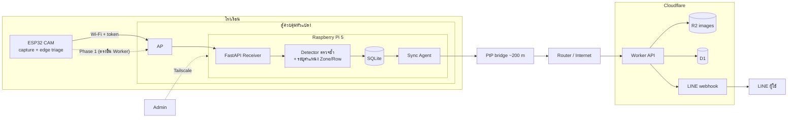

# SINGLE SOURCE OF TRUTH (SSOT): BaiDee (ใบดี) — Smart Leaf Health AI Monitoring

> เวอร์ชัน: 0.3 (2026-09-30) · เจ้าของ: PWD Vision Works · สถานะ: Implementation baseline v0.01
> แทนที่ v0.2 และ v0.1 ("Korea Perilla Leaf AI Monitoring System")

## 0. Change Log & Confirmed Facts

**สิ่งที่เปลี่ยนใน v0.3 (จากการตัดสินใจของเจ้าของ)**
- **โมเดล:** เลิกใช้ Ultralytics YOLO ในเส้นทางผลิตภัณฑ์ → เลือก **RF-DETR (Apache-2.0)** เป็นตัวหลัก มีทางเลือกสำรองและขั้นตอน bake-off (หัวข้อ 6, 10 Phase 2)
- **คลาส:** รวมคลาสที่แยกยาก 5 → **3 คลาสตรวจจับ + HEALTHY แบบสถานะที่คำนวณได้** (หัวข้อ 4)
- **Firmware:** ยืนยัน C/C++ (Arduino-ESP32 / ESP-IDF)
- **ระบบระบุตำแหน่ง:** เพิ่ม Zone/Row marker (AprilTag + QR) หลังรู้ coverage (หัวข้อ 8.5 และ Phase 1.4)
- **เครือข่าย:** ระยะกล้อง–Pi/AP ≈ 200 m → ออกแบบใหม่: ตู้ควบคุมที่หัวแปลง + PtP wireless bridge (หัวข้อ 5)
- **แหล่งไฟ:** มีไฟ 220V → กล้องทำงานแบบ always-on ได้ (รับคำสั่ง "ถ่ายเดี๋ยวนี้" จาก LINE ได้)
- **ผลิตภัณฑ์เชิงพาณิชย์:** เพิ่มวินัยด้านไลเซนส์ (`docs/THIRD_PARTY_LICENSES.md`), ผู้ตรวจ label เป็น Expert Reviewer

**ข้อเท็จจริงที่ยืนยันแล้ว**
- F1: ความสูงกล้อง = **150 เซนติเมตร**
- F2: แปลงอยู่ในโรงเรือน มีหลังคากรองแสง และน้ำไหลผ่านได้ (ต้องเผื่อความชื้น/หยดน้ำ/ไอน้ำ ดูความเสี่ยง R9)
- F3: มีไฟ 220V ให้ใช้ (ใช้อะแดปเตอร์ 5V คุณภาพดี ไม่ต้องพึ่งแบตเตอรี่)
- F4: ระยะจากกล้องถึง AP/Pi ≈ 200 m (เกินระยะ Wi-Fi ของ ESP32 → ต้องมี bridge)
- F5: ต้องการขายเป็นผลิตภัณฑ์ในอนาคต
- F6: มีผู้ช่วยยืนยัน label โรค

**ที่ยังต้องยืนยัน:** รายละเอียดเชิงกายภาพที่มีผลต่อ coverage และ layout ให้ยืนยันระหว่าง Phase 1; ข้อจำกัดเครือข่าย/สแลน/ผู้ตรวจ/กลุ่มลูกค้าถูกยืนยันแล้ว

**Cloudflare deployment baseline (v0.01)**
- Account: `baidee@pwdvisionworks.com` (`a1975d6f01f07f5f4fc8b8509d936003`)
- Worker: `baidee-api`
- R2 bucket: `baidee`
- D1 database: `baidee` (`202de077-29c6-4d3e-b2cb-b3730f3f3573`)
- Wrangler config: `cloud/wrangler.jsonc`
- Release tag: `v0.01`

---

## 1. Project Metadata

| หัวข้อ | รายละเอียด |
|---|---|
| **Product Name** | **BaiDee (ใบดี)** |
| **Model family** | `baidee-perilla` (v1), ต่อยอด `baidee-chili`, `baidee-basil`, `baidee-lettuce` ฯลฯ |
| **Owner brand** | PWD Vision Works (R&D / IP) · alert persona: พิวดี้ (PiWD) |
| **Target Area (pilot)** | แปลงชิโสะเกาหลี กว้าง 1 m × ยาว 20 m ในโรงเรือนหลังคากรองแสง |
| **Pilot Setup** | กล้อง 1 ตัวอยู่กับที่ สูง 150 cm เพื่อพิสูจน์ coverage จริง แล้วตัดสินใจ: เพิ่มจำนวนกล้อง / รางเลื่อน / กล้อง 12MP ตามความคุ้มค่า |
| **Core Goal** | ตรวจใบเครียด (ขาดน้ำ/ขาดธาตุอาหาร/เหลือง/แห้ง), รอยแมลงกัด (รู), และเชื้อรา ด้วย AI image processing บน Raspberry Pi, sync ผ่าน Cloudflare (Tailscale สำหรับผู้ดูแล), แจ้งเตือนทาง LINE พร้อมบอกตำแหน่งโซน/แถวที่ผิดปกติ |
| **Business Intent** | พัฒนาเป็นผลิตภัณฑ์ขาย → ต้องใช้ซอฟต์แวร์/โมเดล/ชุดข้อมูลที่ไลเซนส์เอื้อต่อการขายเท่านั้น |
| **Cloudflare Account** | `baidee@pwdvisionworks.com` · `a1975d6f01f07f5f4fc8b8509d936003` |
| **Cloud Resources** | Worker `baidee-api` · R2 `baidee` · D1 `baidee` |

---

## 2. Brand: ชื่อ โลโก้ Tagline

### 2.1 ชื่อ
- **BaiDee (ใบดี)**: "ใบ" = ใบพืช, "ดี" = สุขภาพดี · ลงท้าย "ดี" เหมือน PiWD / พิวดี้
- อ่านไทย "ใบ-ดี" อ่านสากล "Bai-Dee"
- รูปแบบเขียน: `BaiDee` ใน UI, `baidee` ใน repo/โดเมน/ตัวแปร
- ชื่อรุ่นตามพืช: `BaiDee Perilla`, `BaiDee Chili`, `BaiDee Basil`
- **TODO ก่อนใช้จริง (เพราะจะขายเป็นผลิตภัณฑ์):** ตรวจโดเมน (baidee.ai / baidee.co.th / baidee.farm) และค้นเครื่องหมายการค้าในไทยก่อนพิมพ์โลโก้/บรรจุภัณฑ์ เพราะเป็นคำทั่วไป อาจซ้ำ

### 2.2 แนวคิดโลโก้ (Concept Brief)
**Idea หลัก: "ใบไม้ที่เป็นหน้านกฮูก" (Leaf-Owl)**
- โครงหน้า/หัวนกฮูกสร้างจากรูป **ใบชิโสะ** (ขอบจักฟันเลื่อยเป็นเอกลักษณ์ ใช้เป็นขนหัว/ขอบหน้า)
- **เส้นกลางใบ (midrib)** เป็นจะงอยปาก เส้นแขนงใบเป็นขนหน้าอก
- **ตาสองข้าง** เป็นเลนส์กล้อง: ข้างหนึ่งมีวงรูรับแสง (aperture) อีกข้างมีเครื่องหมายถูก (✓) จาง ๆ สื่อ "ตรวจแล้วดี"
- อ่านออกทั้งสองแบบ: นกฮูก (Vision AI, ตรงกับพิวดี้) และใบไม้ (เกษตร)

**สีและรูปแบบ**
- เขียวใบชิโสะ (primary) + ม่วงเข้ม (สีท้องใบชิโสะพันธุ์แดง, accent) + ขาว/เทา
- 3 เวอร์ชัน: (1) สีเต็ม, (2) โมโนโครมเส้นเดียว สำหรับสติกเกอร์/ซิลค์สกรีน/บอร์ด, (3) ไอคอนสี่เหลี่ยมมุมมน สำหรับ LINE OA และ favicon
- Wordmark: `BaiDee` ตัวอักษรกลมมน + `ใบดี` ตัวอักษรไทยหัวกลม ขนาดเล็กกว่าอยู่ด้านล่าง
- ต้องอ่านออกที่ 32×32 px

**การใช้กับพิวดี้:** พิวดี้เป็น mascot และเสียงของแบรนด์ใน LINE ส่วนโลโก้ BaiDee เป็นเครื่องหมายผลิตภัณฑ์ ไม่ต้องวาดพิวดี้ซ้ำในโลโก้

### 2.3 Tagline
| ภาษา | ตัวเลือก | หมายเหตุ |
|---|---|---|
| ไทย (หลัก) | **"ตาที่เฝ้าดูใบ ให้ทุกใบดี"** | เล่นคำ ดี = สุขภาพดี |
| ไทย (สั้น) | "ใบดี ตรวจก่อน เห็นก่อน" | ใช้บนกล่อง/โฆษณา |
| ไทย (ทางเลือก) | "ดูใบให้ ก่อนใบจะบอก" | โทนเป็นกันเอง |
| อังกฤษ (หลัก) | **"Every leaf, well watched."** | |
| อังกฤษ (ทางเลือก) | "See it before the leaf tells you." | |

### 2.4 น้ำเสียงการแจ้งเตือน (พิวดี้)
> "พิวดี้ตรวจแล้วครับ แปลง 1 โซน 3 แถว B ต้นที่ประมาณ 5 มีใบเริ่มเหลือง 3 จุด ความมั่นใจ 87% ดูภาพและตำแหน่งได้ที่นี่ครับผม"

หลักการ: บอก ที่ไหน / อะไร / มั่นใจแค่ไหน / ทำอะไรต่อ และไม่ตื่นตระหนกเกินเหตุ

---

## 3. Naming Conventions (บังคับใช้ทั้งระบบ)

| สิ่งที่ตั้งชื่อ | รูปแบบ | ตัวอย่าง |
|---|---|---|
| Site / Bed / Zone | `s{nn}` / `b{nn}` / `z{nn}` | `s01`, `b01`, `z03` |
| Row / Plant slot | `r{A-Z}` / `p{nn}` | `rB`, `p05` |
| **Location code** | `{site}-{bed}-{zone}-{row}-{plant}` | `s01-b01-z03-rB-p05` |
| **Node ID** (อุปกรณ์กล้อง) | `bd-{site}-{bed}-c{nn}` | `bd-s01-b01-c01` |
| Edge server (Pi) | `bd-{site}-pi{nn}` | `bd-s01-pi01` |
| Capture ID | `{UTC yyyymmddThhmmssZ}_{node_id}` | `20260930T074500Z_bd-s01-b01-c01` |
| ไฟล์ภาพบน Pi | `/data/baidee/images/{yyyy}/{mm}/{dd}/{capture_id}.jpg` | |
| R2 object key | `raw/{site}/{bed}/{yyyy}/{mm}/{dd}/{capture_id}.jpg` และ `thumb/...` | |
| Class (enum, ห้ามเปลี่ยนชื่อ) | UPPER_SNAKE_CASE + `class_id` คงที่ | ดูหัวข้อ 4 |
| Model | `baidee-{crop}` + semver | `baidee-perilla@0.1.0` |
| Model file | `baidee-{crop}_{semver}_{stage}.{ext}` | `baidee-perilla_0.1.0_pi.onnx`, `baidee-perilla_0.1.0_edge.tflite` |
| Dataset version (Roboflow) | `baidee-{crop}-ds{nn}` | `baidee-perilla-ds03` |
| Env / ตัวแปร | `BAIDEE_*` | `BAIDEE_WORKER_URL` |

**โครงสร้าง Repo (monorepo เดียว เหมาะกับคนพัฒนาคนเดียว)**
```
baidee/
├─ firmware/        # ESP32 (C/C++): capture, upload, OTA, edge triage
├─ edge/            # Raspberry Pi 5: FastAPI, inference, SQLite, sync, bed_layout.yaml
├─ cloud/           # Cloudflare Worker, D1 migrations, R2 config, LINE webhook
├─ ml/              # classes.yaml, dataset tools, Colab notebooks, eval, export
├─ tools/           # organize_dataset.py, coverage_calc.py, markers/ (สร้างป้าย AprilTag/QR)
└─ docs/            # SSOT.md, ADR, THIRD_PARTY_LICENSES.md, คู่มือติดตั้ง
```
GitHub: private repo ชื่อ `baidee`

---

## 4. Target Classes & Annotation Standards

### 4.1 คลาสที่ใช้จริง (v1, หลังรวมคลาส)

| class_id | class | ชนิด | คำนิยาม |
|---|---|---|---|
| 0 | `HEALTHY` | **สถานะที่คำนวณได้** (ไม่ใช่ bbox) | ไม่พบความผิดปกติเหนือ threshold ใน tile/ภาพนั้น |
| 1 | `LEAF_STRESS` | detection | ใบเครียด: เหลือง/ซีด (chlorosis), ขอบไหม้/แห้ง, ใบม้วน/ห้อย/เหี่ยว **(รวมจากขาดน้ำ + ขาดธาตุอาหาร)** |
| 2 | `PEST_DAMAGE` | detection | รูทะลุ รอยแทะ |
| 3 | `FUNGAL_INFECTION` | detection | จุด/ราแป้ง/downy mildew/จุดสีน้ำตาลบนใบ |

- `HEALTHY` ไม่ถูก train เป็น bbox: ภาพที่ไม่มีความผิดปกติใส่เป็น **ภาพพื้นหลัง (null annotation)** สัดส่วนประมาณ 10-30% ของ dataset เพื่อลด false positive
- `health_score` (0-1) คำนวณจากพื้นที่ defect ต่อพื้นที่ใบใน tile และความมั่นใจ (นิยามในเวลา implement Phase 3)

### 4.2 กลยุทธ์ Label แบบ "label ละเอียด รวมตอน train"
เพื่อไม่ทิ้งข้อมูลและแยกคลาสกลับได้ในอนาคต (เมื่อมีข้อมูลหรือเซนเซอร์ช่วย):
- ผู้ตรวจ label ใน Roboflow ด้วยคลาสละเอียด: `WATER_DEFICIT`, `NUTRIENT_DEFICIT`, `STRESS_UNSPECIFIED` (ใช้เมื่อไม่แน่ใจ), `PEST_DAMAGE`, `FUNGAL_INFECTION`
- ตอนสร้าง dataset version ใช้ขั้นตอน remap/merge classes (Roboflow: Modify Classes ตรวจเมนูปัจจุบัน) รวม 3 คลาสแรกเป็น `LEAF_STRESS`
- เมื่อพร้อมแยกในอนาคต: สร้าง version ใหม่โดยไม่ merge (ไม่ต้อง label ใหม่)
- ตอนใช้งานจริง ให้ใส่ `stress_hint` (`water`/`nutrient`/`unknown`) จากเซนเซอร์ความชื้นดิน (ถ้ามี) เป็นคำใบ้ใน payload เท่านั้น ยังไม่ใช่ผลของโมเดล

### 4.3 กฎ Annotation
1. วาด bbox ครอบ **บริเวณที่ผิดปกติ** ไม่ใช่ครอบทั้งใบ ยกเว้น `LEAF_STRESS` แบบใบเหี่ยว/ม้วนที่ครอบทั้งใบ
2. ใบที่มีหลายอาการ ให้ติดหลาย box ต่อหนึ่งใบได้
3. ไม่ label สิ่งที่เล็กกว่า 12 px (ในภาพต้นฉบับ) หรือเบลอจนคนตัดสินเองไม่ได้ ให้เก็บใน `ignore`
4. **Expert Reviewer** (ผู้ช่วยยืนยันโรค) ตรวจ: (ก) 100% ของคลาส `FUNGAL_INFECTION`, (ข) 10% สุ่มของคลาสอื่น, (ค) golden set ทั้งหมด
5. เมื่อ label ขัดกัน: ให้ Expert Reviewer ตัดสิน และบันทึกใน `ml/label_disputes.csv` (ภาพ, เหตุผล) เพื่อปรับแนวทาง
6. **เอกสารแนวทาง `ml/LABELING_GUIDE.md`** พร้อมภาพตัวอย่างคลาสละ ≥ 5 ภาพ ต้องเสร็จก่อน label จริง
7. แท็ก/ป้ายอ้างอิงในภาพ (AprilTag, gray card) **ไม่ต้อง label** และต้องปรากฏในภาพตั้งแต่ก่อนเก็บ dataset หลัก

---

## 5. Hardware & Network Blueprint

| ชั้น | อุปกรณ์/บริการ | บทบาท |
|---|---|---|
| Edge Capture | **ESP32-S3 CAM (แนะนำ)** หรือ ESP32-CAM (AI-Thinker) ในเคสกันน้ำ + ฮูด | ถ่ายภาพ, triage เบื้องต้น, ส่งภาพ (always-on + ตารางถ่าย) |
| Site Cabinet | ตู้กันน้ำ/กันฝุ่นที่หัวแปลง: Pi 5, AP, UPS ขนาดเล็ก, ปลั๊กกันไฟกระชาก | ศูนย์กลาง network + compute ของแปลง (ขยายหลายกล้อง/รางได้) |
| Edge Compute | Raspberry Pi 5 (8GB) + **SSD/NVMe** (ไม่ใช้ SD เป็นที่เก็บหลัก) | รับภาพ, เก็บภาพ, inference ซ้ำ, ฐานข้อมูล, dashboard ภายใน |
| Long-haul Link | **Outdoor PtP wireless bridge 5 GHz (คู่)** ~200 m แบบเห็นกัน (LOS) | เชื่อมตู้ที่แปลงกับ router/อินเทอร์เน็ตที่อาคาร |
| Admin Overlay | Tailscale (บน Pi และเครื่องผู้ดูแล) | เข้าจัดการระยะไกล ไม่เปิด public IP |
| Cloud | Cloudflare Workers + R2 + D1 | รับ/เก็บข้อมูล, dashboard, LINE webhook |
| Alert | LINE Messaging API (ผ่าน LINE OA ของบริษัท) | แจ้งเตือน + ตอบคำสั่ง |

### 5.1 เครือข่ายเมื่อระยะ ≈ 200 m
ESP32 มี Wi-Fi 2.4 GHz กำลังส่งต่ำ ต่อตรง 200 m ในโรงเรือนไม่เสถียร และสาย LAN ยาวเกิน 100 m ผิดมาตรฐาน ตัวเลือก:

| ทางเลือก | โครงสร้าง | ข้อดี | ข้อเสีย |
|---|---|---|---|
| **A (แนะนำ)** | ESP32 →(Wi-Fi สั้น <30 m)→ AP/Pi ในตู้ที่หัวแปลง →(PtP bridge 200 m)→ router → Internet | ESP32 สัญญาณดี, Pi ใกล้กล้อง, ระบบยังตรวจ/เก็บภาพได้ตอน bridge ล่ม (แค่ sync/LINE ช้า) | มีอุปกรณ์ในโรงเรือนชื้น (ต้องตู้กันน้ำ) |
| B | ESP32 → AP ที่แปลง → PtP bridge → **Pi ที่อาคาร** | Pi อยู่ที่แห้ง ปลอดภัย | bridge ล่ม = ระบบหยุดทั้งหมด, ESP32 ต้องบัฟเฟอร์ภาพเอง |
| C | สายไฟเบอร์/สาย LAN + switch กลางทาง | เสถียรที่สุด | งานเดินสาย/ค่าใช้จ่ายสูงกว่า |

**ข้อเสนอ:** เลือก **A** — เพราะหลัก edge คือประมวลผลใกล้ข้อมูล และรองรับขยายหลายกล้อง/ราง ตู้เดียวรองรับได้

**ข้อควรระวัง:** ตรวจ LOS 200 m ก่อนซื้อ, ต่อสายดิน + ป้องกันฟ้าผ่า/ไฟกระชากที่อุปกรณ์กลางแจ้ง, ใช้ UPS กัน Pi ดับกะทันหัน (SD/ระบบไฟล์เสีย), ระบายความร้อนตู้ (โรงเรือนร้อนชื้น)

### 5.2 หมายเหตุอื่น
- ESP32 ติดตั้ง Tailscale ไม่ได้ ใช้เฉพาะฝั่ง Pi/ผู้ดูแล
- Cloudflare Worker เข้าถึง Pi ผ่าน tailnet โดยตรงไม่ได้ → **Pi ส่งข้อมูลออก (outbound push) ไป Worker** (หรือใช้ Cloudflare Tunnel ถ้าต้องดึงเข้า)
- LINE Notify ปิดให้บริการแล้ว (31 มี.ค. 2025) ใช้ **LINE Messaging API** เท่านั้น
- ESP32-S3 ในโรงเรือนร้อนชื้น: ใช้ไฟ 5V ≥ 2A, ปิด LED แฟลช, ทำฮูดกันหยดน้ำ/แสงจ้า, ระบายความร้อนเคส

### 5.3 Data Flow (ปลายทาง)


---

## 6. Software Stack & Conventions

| ส่วน | เลือกใช้ | หมายเหตุ |
|---|---|---|
| ESP32 firmware | **C/C++ บน Arduino-ESP32 หรือ ESP-IDF** | ยืนยันแล้ว (D-002) |
| Wi-Fi provisioning | WiFiManager (Arduino) หรือ ESP-IDF provisioning | |
| Pi backend | Python 3.11+, FastAPI, OpenCV (มี `cv2.aruco`), onnxruntime, SQLite (WAL) | |
| **Detector (หลัก)** | **RF-DETR (Apache-2.0)** รุ่น Nano/Small/Medium เท่านั้น export **ONNX** | **ห้ามใช้ XL/2XL** (ไลเซนส์ PML 1.0 แยกต่างหาก) |
| Detector (สำรอง/เทียบ) | YOLOX (Apache-2.0), D-FINE / DEIM (Apache-2.0, ตรวจไลเซนส์ล่าสุดของ repo และ weights) | เข้ารอบ bake-off |
| Edge triage (ESP32) | rule-based HSV ก่อน แล้วค่อยเพิ่ม tiny classifier (TFLite Micro / ESP-DL) | ตรวจไลเซนส์ ESP-DL ก่อนใช้เชิงพาณิชย์ |
| Cloud | Cloudflare Workers (TypeScript), R2, D1, Cloudflare Access | |
| Annotation/Training | Roboflow → Google Colab | เก็บข้อมูลและ label ในสิทธิ์ของบริษัท |
| Alert | LINE Messaging API | |

**นโยบายไลเซนส์ (เพราะจะขายเป็นผลิตภัณฑ์)**
- ห้ามนำ Ultralytics YOLO เข้าเส้นทางผลิตภัณฑ์ (AGPL-3.0 เว้นแต่ซื้อ Enterprise License) ใช้ได้เฉพาะเป็นตัวเทียบผลในห้องทดลอง ถ้าจะใช้เป็น benchmark ให้แยกออกจาก repo ผลิตภัณฑ์
- ทุก dependency/โมเดล/weights/dataset ต้องลงทะเบียนใน `docs/THIRD_PARTY_LICENSES.md` (ชื่อ, เวอร์ชัน, ไลเซนส์, ลิงก์, ข้อผูกพัน) และ review ก่อนแต่ละ release
- ข้อที่ต้องตรวจเป็นพิเศษ: Arduino-ESP32 (LGPL-2.1 มีข้อผูกพันเรื่องการแจกจ่าย firmware), weights ตั้งต้นที่ pretrain (COCO/DINOv2) ว่าเงื่อนไขอนุญาตการใช้เชิงพาณิชย์, dataset สาธารณะที่นำมาผสม (CC-BY-NC ใช้ไม่ได้)
- ก่อนขายจริง ให้ปรึกษาผู้เชี่ยวชาญด้านกฎหมายซอฟต์แวร์ (เอกสารนี้ไม่ใช่คำปรึกษาทางกฎหมาย)

---

## 7. Data Contract (Payload schema v1.0)

ใช้ตัวเดียวกันทุกชั้น (ESP32 → Pi → Worker → D1) ต่างกันเฉพาะฟิลด์ที่แต่ละชั้นเติม

```json
{
  "schema_version": "1.0",
  "capture_id": "20260930T074500Z_bd-s01-b01-c01",
  "node_id": "bd-s01-b01-c01",
  "site_id": "s01",
  "bed_id": "b01",
  "timestamp": "2026-09-30T07:45:00Z",
  "image_path": "/data/baidee/images/2026/09/30/20260930T074500Z_bd-s01-b01-c01.jpg",
  "image_sha256": "<hex>",
  "image_size": { "w": 1600, "h": 1200 },
  "stage": "pi_verify",
  "edge_triage": { "method": "hsv_ratio", "score": 0.71, "flag": true },
  "model": { "name": "baidee-perilla", "version": "0.1.0", "arch": "rf-detr-small", "format": "onnx" },
  "health_score": 0.82,
  "status": "ATTENTION",
  "detections": [
    {
      "class": "PEST_DAMAGE",
      "class_id": 2,
      "confidence": 0.89,
      "bbox": [x1, y1, x2, y2],
      "location": {
        "zone_id": "z03", "row_id": "rB", "plant_slot": 5,
        "x_m": 3.2, "y_m": 0.55,
        "method": "apriltag_homography", "confidence": 0.9
      }
    }
  ],
  "stress_hint": null,
  "capture_meta": { "rssi": -67, "exposure": null, "fw": "0.1.0", "rail_pos_m": null, "tags_visible": 4 }
}
```

**กฎ**
- `timestamp` เป็น UTC ISO-8601 เสมอ แสดงผลเป็น Asia/Bangkok ที่ UI เท่านั้น
- `bbox` = พิกเซล `[x1,y1,x2,y2]` ของ **ภาพต้นฉบับ**
- `status` ∈ `HEALTHY` | `ATTENTION` | `ALERT` | `CAMERA_FAULT` (คำนวณจากกฎแจ้งเตือน)
- `stage` ∈ `edge_triage` | `pi_verify` | `manual`
- `location` เป็น optional (ว่างได้ถ้าไม่เห็นป้าย) แต่ต้องมี `method` และ `confidence`
- `capture_id` เป็น idempotency key: ส่งซ้ำได้โดยไม่เกิดข้อมูลซ้ำ
- เปลี่ยน schema ต้องเพิ่ม `schema_version` และเขียน migration ใน D1/SQLite

---

## 8. Workflow ทั้งระบบและข้อเสนอแนะ

### 8.1 Workflow (ปลายทาง)
1. **กล้องทำงาน always-on** ตามตาราง capture (เช่น ทุก 1-2 ชม. ช่วงกลางวัน) และ poll คำสั่ง "ถ่ายเดี๋ยวนี้" จาก Pi ทุก ~30-60 วินาที
2. **ถ่ายภาพ** ค่าเดียวกันทุกครั้ง (ล็อก exposure/WB หลังวอร์มอัพ)
3. **Edge triage** บน ESP32: ประเมินเร็ว ๆ ว่าน่าสงสัยหรือไม่
4. **ส่งภาพ + ผล triage** ไป Pi (Wi-Fi ในโรงเรือน) ถ้าไม่ได้ให้ retry และเก็บคิวใน SD
5. **Pi ตรวจซ้ำ:** ตรวจ AprilTag → คำนวณ homography → รัน detector แบบ tiling → แปลงตำแหน่งภาพ → (zone, row, plant) → คำนวณ health_score
6. **Sync Agent** ส่งผล + thumbnail ขึ้น Worker เป็นปกติ ส่งภาพต้นฉบับเมื่อผิดปกติ
7. **กฎแจ้งเตือน** (8.3) → LINE พร้อมตำแหน่งและภาพครอป
8. **Dashboard/LINE:** ผู้ใช้ยืนยัน/ปฏิเสธผล → feedback กลับเข้า dataset (Expert Reviewer ตรวจก่อนเข้า train)

### 8.2 ข้อค้นพบสำคัญ: Coverage ของกล้องตัวเดียว (คำนวณประมาณการ)

สมมติกล้อง OV2640 (FOV เฉียง ~65°, ต้องวัดจริง) มองตรงลงจาก **150 cm** (ยืนยันแล้ว), ภาพ 1600×1200 (4:3):

| รายการ | ค่าประมาณ |
|---|---|
| พื้นที่ที่เห็นบนพื้น | **≈ 1.5 m × 1.15 m** |
| ความละเอียดพื้นดิน (GSD) | ≈ 0.96 mm/px |
| รูแมลงกัดขนาด 4 mm | ≈ 4 px (เล็กเกินไป) |
| จำนวนกล้องเพื่อครอบคลุมแปลง 20 m | **≈ 18 ตัว** (ไม่ซ้อน) ถึง ≈ 22 ตัว (ซ้อน 20%) |

เกณฑ์ตั้งต้น: วัตถุที่ต้องการตรวจควรมี **≥ ~16 px** รูขนาด 4 mm จึงต้องการ GSD ≈ 0.25 mm/px

| กล้อง | ระยะที่ให้ GSD ≈ 0.25 mm/px | พื้นที่ที่เห็นต่อภาพ |
|---|---|---|
| OV2640 (1600×1200) | สูงจากใบ ≈ 0.4 m | ≈ 0.4 × 0.3 m → ~50 ตำแหน่งต่อแปลง |
| Pi Camera Module 3 (12MP) | สูงจากใบ ≈ 0.9 m | ≈ 1.15 × 0.65 m → ~17-20 ตำแหน่งต่อแปลง |

**ข้อสรุป:** กล้องเดียวที่ 150 cm ตรวจ "อาการระดับแปลง" ได้ (เหลืองเป็นหย่อม, เหี่ยว) แต่ **ไม่พอสำหรับรูแมลงและจุดราระยะเริ่มต้น** และครอบคลุมแปลงเพียง ~5-7% ของความยาว ให้ Coverage Experiment ยืนยัน และออกแบบเผื่อ **รางเลื่อน + กล้อง 12MP** (ที่ตู้ควบคุมเดียวกัน) ตัวเลขเป็นประมาณการ ใช้ `tools/coverage_calc.py` คำนวณซ้ำหลังวัด FOV จริง

**ผลของหลังคากรองแสง:** แสงกระจายตัวช่วยลดเงาแข็ง แต่ความเข้มแสงต่ำทำให้ exposure นาน → ภาพเบลอ/noise ได้ง่ายบน OV2640; ต้องทดสอบเวลาเช้า/บ่าย/ฝน และอาจต้องใช้ไฟเสริม LED ขาวคงที่ตอนถ่าย

### 8.3 กฎแจ้งเตือน LINE (ลด false alarm)
- แจ้งเมื่อพบคลาสผิดปกติ confidence ≥ threshold ต่อคลาส **และ** พบซ้ำ ≥ 2 ครั้งติดต่อกันใน 24 ชม. หรือมี area รวมเกินเกณฑ์
- รวมข้อความรายวัน (daily digest) เป็นค่าเริ่มต้น ส่งทันทีเฉพาะระดับรุนแรง
- Cooldown ต่อ (โซน, คลาส) อย่างน้อย 6 ชม.
- มีปุ่ม "ยืนยัน / ไม่ใช่" ใน LINE เพื่อเก็บ feedback
- แจ้ง `CAMERA_FAULT` เมื่อ: ไม่มีภาพตามกำหนด, ภาพเบลอ/มืดผิดปกติ, ป้ายอ้างอิงเห็นน้อยกว่าปกติ (เลนส์เปื้อน/กล้องขยับ)
- ตรวจโควตาข้อความของแพ็กเกจ LINE OA ปัจจุบันก่อนออกแบบความถี่

### 8.4 ข้อเสนอแนะแนวทางพัฒนา
1. **พิสูจน์ก่อนสร้าง:** Coverage Experiment + เก็บภาพจริง 2 สัปดาห์ก่อนลงทุนกล้องเพิ่ม/ราง
2. **ตรวจง่ายก่อน:** `LEAF_STRESS` (ระดับแปลง) → ต่อด้วยรู/จุดราเมื่อได้ภาพความละเอียดสูงขึ้น
3. **เพิ่มเซนเซอร์ราคาถูก** (ความชื้นดิน, อุณหภูมิ/ความชื้นอากาศ) เพื่อให้ `stress_hint` แยกน้ำ/ธาตุอาหารในอนาคต และเป็น bundle สินค้า ESP32 ของ PWD Vision Works
4. **Human-in-the-loop:** ผลทุกครั้งกด ยืนยัน/แก้ไข → Expert Reviewer → เข้า dataset (active learning)
5. **แยก "Model ต่อพืช" กับ "Platform":** pipeline, schema, Worker, LINE ใช้ร่วมกัน เปลี่ยนแค่ `classes.yaml` + weights
6. **ความเร็วไม่ใช่ปัญหา:** ถ่ายทุกชั่วโมง → เลือกโมเดลโดยให้น้ำหนัก **ความแม่นยำก่อนความเร็ว** ได้ (ขอแค่ inference ต่อภาพไม่เกินไม่กี่ครั้งต่อนาที) ไม่ต้องบีบโมเดลเล็กสุดเสมอไป
7. **เตรียมทางขาย:** "BaiDee Kit" (ESP32 + เซนเซอร์ + ป้ายอ้างอิง + คู่มือ) และ "BaiDee Edge Box" (Pi 5 preload + ตู้) ตามโครงสินค้าเดิม

### 8.5 ระบบระบุตำแหน่ง Zone / Row (ทำหลัง Phase 1 รู้ coverage)

**เป้าหมาย:** เมื่อ AI พบความผิดปกติ ผู้ใช้เดินไปดูต้นนั้นได้ทันที

**โครงสร้างพิกัดแปลง**
- แกน x = ระยะตามความยาวแปลง 0-20 m จากหัวแปลง แกน y = ตำแหน่งข้าม (0-1 m)
- **Zone** `z01…` = ช่วงตามความยาว (1 zone = 1 ภาพกล้อง หรือ 1 จุดจอดของราง)
- **Row** `rA, rB…` = แถวปลูกเรียงจากซ้ายเมื่อยืนที่หัวแปลง
- **Plant slot** `p01…` = ลำดับต้นในแถว (ถ้าปลูกระยะสม่ำเสมอ = `round(x / spacing)`)
- ค่ากำหนดทั้งหมดเก็บใน `edge/bed_layout.yaml` (จำนวนแถว, ระยะปลูก, ความยาวโซน, พิกัดป้ายแต่ละตัว)

**ป้ายสองชนิดคนละหน้าที่**
| ชนิด | ผู้ใช้ | รูปแบบ | หน้าที่ |
|---|---|---|---|
| **AprilTag** (family `tag36h11`) | เครื่อง (Pi) | 4 ตัวต่อโซน วางมุมโซนที่ขอบแปลง **นอกทรงพุ่มใบ** ขนาดด้านราว 6-8 cm | หา homography แปลงพิกเซล → เมตร → (zone, row, plant), วัดสเกล mm/px อัตโนมัติ, ตรวจกล้องขยับ |
| **QR code + ตัวเลขใหญ่** (`Z03`, `A/B/C`) | คน (มือถือ) | ที่หัวโซน ขนาด ≥ 3-4 cm | สแกนแล้วเปิด deep link `https://<domain>/z/s01-b01-z03` → ผลตรวจล่าสุด, ภาพ, ปุ่มยืนยัน |

- ใช้ AprilTag สำหรับ machine เพราะทนต่อระยะ/มุม/แสงได้ดีกว่า QR ในงานนี้ และ OpenCV รองรับ; ใช้ QR สำหรับคนเท่านั้น (อย่าให้ QR เข้าไปรบกวนการตรวจของเครื่อง จึงแยกตำแหน่งกัน)
- **แผ่นป้ายรวม:** ที่มุมโซน ใช้แผ่นเดียวมี AprilTag + **แถบเทา 18% + แถบสีอ้างอิง** สำหรับปรับ white balance/exposure อัตโนมัติ ช่วยแก้ปัญหาสีเพี้ยนของ OV2640 (R4) พร้อมกัน
- วัสดุ: พิมพ์บนแผ่นอะคริลิก/อะลูมิเนียม/ลามิเนตทนยูวี ผิวด้าน (ไม่สะท้อน) ยึดด้วยสกรู/เสา ทนน้ำและความชื้น เว้นระยะจากน้ำไหลที่ท่วมป้าย
- ตรวจขนาดขั้นต่ำ: ที่ 0.96 mm/px ป้าย 6 cm ≈ 60 px (เกินเกณฑ์ถอดรหัส ~30 px)

**การใช้ในระบบ**
- Pi ตรวจ tag ทุกภาพ → คำนวณ homography → แปลงจุดกึ่งกลาง bbox เป็น (x_m, y_m) → `location` ใน payload
- ถ้าเห็น tag ไม่ครบ: ใช้ homography ล่าสุดที่ดีและตั้ง `location.confidence` ต่ำ
- ถ้า tag ขยับในภาพเกินเกณฑ์ (px) → แจ้ง `CAMERA_FAULT: กล้องขยับ/เลนส์เปื้อน`
- ข้อความ LINE: "แปลง b01 โซน 3 แถว B ต้นที่ ~5 (ห่างหัวแปลง ~3.2 m)" + ภาพครอปบริเวณ + ลิงก์หน้าโซน
- กรณีรางเลื่อน: เพิ่ม `rail_pos_m` (จากตัวเข้ารหัส/limit switch) และอาศัย tag ยืนยันตำแหน่งจริงทุกจุดจอด

**เครื่องมือ:** `tools/markers/generate_markers.py` สร้างแผ่นพิมพ์ (AprilTag + QR + แถบสี) จาก `bed_layout.yaml`

---

## 9. Risk Register

| # | ความเสี่ยง | ผลกระทบ | ระดับ | การรับมือ / สถานะ |
|---|---|---|---|---|
| R1 | กล้องตัวเดียวที่ 150 cm ความละเอียดไม่พอสำหรับรู/จุดรา และครอบคลุมสั้น | ต้องเปลี่ยนสถาปัตยกรรม | **สูง** | Coverage Experiment ก่อน, เผื่อราง + กล้อง 12MP, ตู้ควบคุมรองรับขยาย |
| R2 | ~~ไลเซนส์ Ultralytics AGPL-3.0~~ | ขายผลิตภัณฑ์ไม่ได้ | **จัดการแล้ว (แผน)** | ใช้ RF-DETR (Apache-2.0) + bake-off กับ YOLOX/D-FINE; ทะเบียนไลเซนส์; ห้าม Ultralytics ในเส้นทางผลิตภัณฑ์ |
| R2b | ไลเซนส์ของ weights ตั้งต้น/ชุดข้อมูลสาธารณะ/ไลบรารี firmware ไม่เอื้อต่อการขาย | ต้องรื้อภายหลัง | กลาง | ตรวจทีละรายการใน `THIRD_PARTY_LICENSES.md` ก่อน Phase 2 และก่อน release, ห้ามใช้ RF-DETR XL/2XL (PML 1.0) |
| R3 | ข้อมูลโรคจริงหายาก → dataset ไม่สมดุล | Recall ต่ำในคลาสสำคัญ | สูง | เก็บถี่ตั้งแต่ Phase 1, ขอใบป่วยจากแปลงอื่น (พร้อมสิทธิ์การใช้ภาพ), augmentation, active learning |
| R4 | ภาพจาก OV2640 คุณภาพต่ำ/สีเพี้ยน/แสงน้อยใต้หลังคากรองแสง | ผลแกว่ง | สูง | ล็อก AE/AWB, แผ่นป้ายมีแถบเทา/สี, เก็บภาพหลายช่วงแสง, พิจารณาไฟเสริม/กล้อง 12MP |
| R5 | ~~คลาสแยกยากจาก RGB~~ | Confusion matrix ปน | **จัดการแล้ว** | รวมเป็น `LEAF_STRESS`; label ละเอียดแล้วรวมตอน train เพื่อแยกกลับได้ภายหลัง; ใช้ `stress_hint` จากเซนเซอร์ |
| R6 | YOLO/โมเดลหนักรันบน ESP32 ไม่ได้จริง (RAM ~520KB + PSRAM ~4-8MB) | แผน Phase 4 ผิดพลาด | สูง | ESP32 ทำ triage เท่านั้น (HSV → tiny classifier) |
| R7 | ~~Rust บน ESP32~~ | เสียเวลา | **จัดการแล้ว** | ใช้ C/C++ |
| R8 | ไฟ/ความร้อน: ESP32 always-on ในโรงเรือนร้อนชื้น, ไฟกระชาก, ไฟดับ | รีเซ็ต/ฮาร์ดแวร์เสีย/SD เสีย | กลาง | PSU คุณภาพดี + ตัวเก็บประจุ, ปลั๊กกันไฟกระชาก, UPS ที่ตู้, Pi ใช้ SSD, watchdog, ระบายความร้อน |
| R9 | ความชื้น/หยดน้ำ/ไอน้ำเกาะเลนส์, น้ำไหลผ่าน, ฝุ่น, แมลง | ภาพเสียทั้งวัน/อุปกรณ์เสีย | **สูง** | เคสกันน้ำ IP65+ พร้อมฮูดกันหยด, ตำแหน่งกล้องพ้นน้ำไหล, เลนส์กันฝ้า (ซิลิกาเจล/ฮีตเตอร์เล็ก), ตรวจคุณภาพภาพอัตโนมัติ → `CAMERA_FAULT` |
| R10 | **เครือข่าย 200 m:** bridge ล่ม/สัญญาณรบกวน/ไม่เห็นกัน (LOS) | ข้อมูลไม่ขึ้น cloud, LINE ไม่ส่ง | **สูง** | ตรวจ LOS ก่อนซื้อ, PtP 5 GHz คู่ คุณภาพ outdoor, Pi เก็บ/ตรวจต่อเองเมื่อ link ล่ม (คิว + retry), แจ้งเตือน link down ผ่านช่องทางสำรอง |
| R11 | ความปลอดภัย: token รั่ว, endpoint สาธารณะถูกยิง, LINE secret, **`set_wifi` command เก็บรหัสผ่าน Wi-Fi เป็น plaintext ใน D1 `commands.args_json`** (เพิ่มใน Phase 1.2) | ค่าใช้จ่าย/ข้อมูลรั่ว | กลาง | token ต่ออุปกรณ์ + HMAC, rate limit, Cloudflare Access, Worker Secrets; **ก่อนใช้แปลงจริงต้องผูก Cloudflare Access กับ `/dashboard` และ `/v1/*`, และพิจารณาเข้ารหัส/ลบ `args_json` ของคำสั่ง `set_wifi` หลังส่งสำเร็จ**; **เพิ่มระบบ user/password (`users` table, PBKDF2, signed session cookie) ใน Phase 3B แทนการแชร์ bearer token เดียวกันทุกคน — `BAIDEE_API_TOKEN` ยังคงอยู่แต่ลดบทบาทเหลือ service credential สำหรับสคริปต์ (เช่น `organize_dataset.py`) เท่านั้น ไม่ใช่ auth หลักของ dashboard อีกต่อไป** |
| R12 | ต้นทุน/โควตา R2, D1, LINE | ระบบหยุดเมื่อเกินโควตา | ต่ำ-กลาง | บีบอัด JPEG, ต้นฉบับเฉพาะภาพผิดปกติ, thumbnail ที่เหลือ, retention policy |
| R13 | Pi/SSD เสียหรือขโมย | ข้อมูลหาย | กลาง | backup รายคืนไป R2, health check, ตู้ล็อก |
| R14 | ไม่มีเกณฑ์ "สำเร็จ" ชัดเจน | ทดสอบไม่จบ | กลาง | Exit Gate เชิงตัวเลขทุก phase |
| R15 | ป้าย Zone/Row สกปรก/ขยับ/ถูกใบบัง | ตำแหน่งผิด/หายไป | กลาง | วางนอกทรงพุ่ม, ตรวจ `tags_visible` ทุกภาพ, ตั้งรอบทำความสะอาดป้าย, แจ้งเตือนเมื่อความมั่นใจต่ำ |
| R16 | ผู้ตรวจ label (Expert) มีเวลาจำกัด | คอขวดของ dataset | กลาง | ตกลงเวลา/สัปดาห์ล่วงหน้า, ให้เขาตรวจเฉพาะที่จำเป็น (FUNGAL 100%, ที่เหลือสุ่ม), ทำ review ผ่านมือถือได้ |

---

## 10. Architecture Blueprint ตามเฟส

**หลักการความต่อเนื่อง:** ทุกเฟสส่งมอบ *Contract* ให้เฟสถัดไป ห้ามข้ามเฟสถ้ายังไม่ผ่าน Exit Gate

```
Phase 1 ──[C1: ภาพ+metadata+layout]──► Phase 2 ──[C2: โมเดล+classes.yaml]──► Phase 3 ──[C3: API/payload v1]──► Phase 4
```

ระยะเวลาเป็นค่าประมาณสำหรับคนเดียวทำงานคู่กับธุรกิจอื่น

---

### PHASE 1 — ESP32 เก็บภาพ ส่งขึ้น Cloudflare และวางระบบตำแหน่ง (≈ 4-5 สัปดาห์)

**เป้าหมาย:** pipeline เก็บภาพที่เสถียร + รู้ coverage จริง + ระบบระบุตำแหน่งพร้อมก่อนเก็บ dataset หลัก

**1.0 Connectivity Setup + Coverage Experiment (ต้นสัปดาห์แรก)**
- (ก) **เครือข่าย:** ตรวจ LOS 200 m ระหว่างหัวแปลง–อาคาร, ติดตั้งตู้ชั่วคราว (AP + PtP bridge), วัด throughput/latency/RSSI ตลอด 24 ชม.; Phase 1 ส่งภาพขึ้น Worker ผ่าน bridge ต้องพร้อมก่อนเริ่มเก็บข้อมูล
- (ข) **Coverage Experiment** (2-3 วัน): ตั้งกล้องสูง 150 cm ถ่ายภาพพร้อมไม้บรรทัด/เป้าวัดขนาด (สติกเกอร์วงกลม 4 mm, 8 mm) วัด: พื้นที่ที่เห็นจริง, GSD, ขนาดวัตถุเป็นพิกเซล, ระยะที่ตรวจเห็นรู 4 mm ทดลองที่ความสูง 50 / 90 / 150 cm เทียบกับโทรศัพท์ และทดลองสภาพแสง (เช้า/บ่าย/เมฆ/ฝน)
- **ผลลัพธ์:** ตาราง coverage + ตัดสินใจ **A) เพิ่มกล้อง / B) รางเลื่อน / C) กล้อง 12MP** พร้อมประมาณต้นทุนคร่าว ๆ

**1.1 Firmware v0.1 (C/C++ บน ESP32-S3 CAM)**
- Wi-Fi provisioning + config ใน NVS
- กล้อง: ความละเอียดสูงสุดที่เสถียร, JPEG quality ~10-12, ล็อก exposure/gain/AWB หลังวอร์มอัพ ทิ้งเฟรมแรก 2-3 เฟรม
- **Always-on** ตามตาราง capture + poll คำสั่ง `GET /v1/cmd?node=...` ทุก 30-60 วินาที (รองรับ "ถ่ายเดี๋ยวนี้"); deep sleep เป็นตัวเลือกใน config ไม่ใช่ค่าเริ่มต้น
- NTP sync → `timestamp` UTC
- Upload: HTTPS POST multipart ไป `POST /v1/ingest` พร้อม `X-Node-Id`, `X-Signature` (HMAC)
- Retry + exponential backoff; คิวใน SD/flash เมื่อเครือข่ายหลุด
- Telemetry: RSSI, เวอร์ชัน fw, อุณหภูมิชิป, เวลา uptime
- **OTA update** ตั้งแต่ v0.1
- ตรวจ heap/PSRAM ต่อเนื่อง (จับ memory leak ระยะยาว) + watchdog

**1.2 Cloudflare Worker v0.1 (`cloud/`)**
- `POST /v1/ingest`: ตรวจ HMAC → R2 (`raw/...`) → D1 (`captures`) แบบ idempotent
- `GET /v1/captures?from&to&node` ป้องกันด้วย Access/token
- `GET /v1/cmd` (คำสั่งไปยังกล้อง; ในเฟสนี้อาจคืนค่าว่างไว้ก่อน)
- Retention: lifecycle rule R2

**1.3 Dataset Collection Plan**
- ถี่ (ทุก 1-2 ชม. ช่วงกลางวัน) เพื่อความหลากหลายของแสง (เริ่มหลังติดป้าย 1.4 เสร็จ)
- `tools/organize_dataset.py`: ดึงจาก R2 → จัดโฟลเดอร์ → ตรวจคุณภาพอัตโนมัติ (blur, มืด/สว่างเกิน, ฝ้า) → `manifest.csv`
- ภาพโทรศัพท์ระยะใกล้ใช้เสริมได้ แต่ **ติดแท็กแหล่งที่มา** ห้ามปนตอนประเมิน

**1.4 Zone & Row Marker System (ทำหลังตัดสินใจ coverage ได้ และก่อนเก็บ dataset หลัก)**
- กำหนด `edge/bed_layout.yaml`: จำนวนแถว, ระยะปลูก, ความยาวโซน (ตามผล coverage)
- สร้างแผ่นป้ายด้วย `tools/markers/generate_markers.py` (AprilTag + QR + แถบเทา/สี) พิมพ์บนวัสดุทนชื้น ติดที่ขอบแปลงนอกทรงพุ่ม
- Pi/บนเครื่อง dev: สคริปต์ตรวจ tag → homography → ทดสอบความแม่นยำ: เอาป้ายตัวทดสอบวางที่ตำแหน่งรู้พิกัด วัดความคลาดเคลื่อน (เป้า ≤ ~5 cm หรือ ≤ ครึ่งระยะปลูก)
- ทดสอบสแกน QR ด้วยมือถือจริงในสภาพแสง/เปียกชื้น
- **ทำก่อนเก็บ dataset หลักเพราะป้ายอยู่ในภาพทุกใบ** (ไม่งั้นเกิด domain shift)

**Contract C1 (ส่งต่อ Phase 2):** ภาพ JPEG ตั้งชื่อตาม `capture_id` + `manifest.csv` + ตารางผล Coverage + `bed_layout.yaml` + ผลทดสอบความแม่นยำพิกัด

**Exit Gate P1**
- [ ] ระบบต่อเนื่อง ≥ 7 วัน ภาพส่งสำเร็จ ≥ 95%, ไม่ซ้ำ/ไม่หาย
- [ ] เครือข่าย 200 m เสถียร (uptime bridge ≥ 99% ใน 7 วัน หรือมีการกู้คืนเองที่พิสูจน์แล้ว)
- [ ] รายงาน Coverage + ตัดสินใจ A/B/C แล้ว
- [ ] ป้ายตำแหน่งใช้งานได้ คลาดเคลื่อนตามเกณฑ์
- [ ] ภาพผ่านคัดคุณภาพ ≥ 300 ภาพ (เป้าเริ่มต้นสำหรับ label รอบแรก)

---

### PHASE 2 — Dataset (Roboflow) และ Train Model (Google Colab) (≈ 4-6 สัปดาห์ ขนานกับเก็บภาพ)

**เป้าหมาย:** โมเดลเวอร์ชันแรกที่ตัดสินใจต่อได้ ไลเซนส์สะอาด export ไปใช้บน Pi ได้

**2.0 ตัดสินใจก่อนเริ่ม (Blocking)**
- ✅ ไลเซนส์: ใช้กลุ่ม Apache-2.0 (RF-DETR เป็นหลัก) ห้าม Ultralytics ในผลิตภัณฑ์
- ตรวจไลเซนส์ weights ตั้งต้นและ dataset ทุกชุด ลงทะเบียนใน `THIRD_PARTY_LICENSES.md`
- ยืนยัน `ml/classes.yaml` (class_id คงที่ ตามหัวข้อ 4)
- เตรียม `LABELING_GUIDE.md` ร่วมกับ Expert Reviewer และตกลงเวลาทำงานรายสัปดาห์

**2.1 Dataset บน Roboflow**
- โปรเจกต์ `baidee-perilla`, นำเข้าตาม `manifest.csv`
- label ด้วยคลาสละเอียดตามหัวข้อ 4.2 แล้ว merge เป็น `LEAF_STRESS` ตอนสร้าง version
- ภาพที่ไม่มีความผิดปกติ: ใส่เป็น null/background 10-30%
- วัดความเห็นตรงกันของผู้ label (label ซ้อน 30-50 ภาพ) + Expert Reviewer ตามข้อ 4.3
- **Split ตามเวลา/ชุดการถ่าย ไม่ใช่สุ่มรายภาพ** (train = สัปดาห์ 1-3, val = สัปดาห์ 4) เพื่อกันข้อมูลรั่ว
- **Golden set** (ไม่ใช้ train) ที่ Expert Reviewer ยืนยันแล้ว 100% ล็อกไว้ตลอดทุกเวอร์ชัน
- Augmentation แบบสมจริง: brightness/contrast/WB shift, blur เล็กน้อย, rotation ต่ำ; **ห้าม hue shift แรง** (เปลี่ยนความหมายของ "เหลือง")
- freeze `baidee-perilla-ds01`

**2.2 Train บน Google Colab (`ml/notebooks/train_*.ipynb`) — Bake-off**
| ผู้เข้ารอบ | ไลเซนส์ (ต้องตรวจซ้ำก่อนใช้) | หมายเหตุ |
|---|---|---|
| **RF-DETR Small/Medium (และ Nano เทียบ)** | Apache-2.0 (เฉพาะรุ่น Apache; XL/2XL เป็น PML 1.0 ห้ามใช้) | ตัวเต็ง; รับ COCO format จาก Roboflow ได้; มี ONNX export |
| YOLOX-S | Apache-2.0 | สำรองที่เบากว่าบน CPU |
| D-FINE-S / DEIM-S | Apache-2.0 (ตรวจ repo/weights) | ตัวเลือกเสริมถ้ามีเวลา |
- เทียบบน **dataset และ golden set เดียวกัน** ด้วย: mAP50 / mAP50-95 **และ recall ของวัตถุเล็ก**, ต่อคลาส, ความเร็วบน Pi 5 (ONNX Runtime, CPU), ความเสถียรของการ export
- **Tiling/SAHI-style** ทั้ง train และ inference เพราะตำหนิเล็ก (อินพุตของโมเดลเล็กจำกัด)
- บันทึก hyperparameters, seed, dataset version, git commit → `model_card.md`
- เกณฑ์ตั้งต้น (ปรับได้หลังเห็นข้อมูล): recall ≥ 0.7, precision ≥ 0.6 ต่อคลาสเป้าหมาย ที่ threshold ที่เลือก และรายงานแยกตามช่วงแสง
- ถ้าคลาสใดต่ำ ตัดสินใจ: เก็บข้อมูลเพิ่ม / เลื่อนไปเวอร์ชันถัดไป / (ถ้าจำเป็น) รวมคลาสเพิ่ม บันทึกใน Decision Log
- **เลือกผู้ชนะด้วยความแม่นยำก่อน** ตราบที่ latency บน Pi 5 ต่อภาพ (รวม tiling) ยอมรับได้ (เป้าเริ่มต้น < 30 วินาทีต่อภาพ เพราะถ่ายทุกชั่วโมง; หากช้ากว่านี้ค่อยพิจารณา accelerator)

**2.3 Export**
- ONNX สำหรับ Pi (`baidee-perilla_0.1.0_pi.onnx`) ทดสอบผลตรงกับ PyTorch (ต่าง bbox/conf ในเกณฑ์)
- ESP32: ยังไม่ export detector; สร้างชุด "ปกติ/ผิดปกติ" สำหรับ triage classifier ใน Phase 4

**Contract C2 (ส่งต่อ Phase 3):**
`ml/release/baidee-perilla_0.1.0/`: `*.onnx`, `classes.yaml`, `model_card.md`, `eval_report.md`, `thresholds.yaml`, `sample_inputs/` + `sample_outputs.json` (regression test บน Pi), และ **`THIRD_PARTY_LICENSES.md` ที่อัปเดตแล้ว**

**Exit Gate P2**
- [ ] model_card + eval_report ทำซ้ำได้
- [ ] ผลตามเกณฑ์ที่ตกลง หรือมีบันทึกยอมรับข้อจำกัดชัดเจน
- [ ] ONNX ตรงกับ PyTorch บนชุดตัวอย่าง
- [ ] ไลเซนส์ของโมเดล/weights/ข้อมูล/ไลบรารีทุกชิ้นตรวจแล้วและลงทะเบียนแล้ว

---

### PHASE 3 — Web App บน Raspberry Pi 5 (+AI) และบน Cloudflare Worker (≈ 4-5 สัปดาห์)

**เป้าหมาย:** ภาพเข้า → ตรวจ → ระบุตำแหน่ง → เก็บ → แจ้งเตือน → ดูผลผ่านเว็บ ครบวงจร

**3A. Raspberry Pi 5 ในตู้ควบคุม (`edge/`)**
- Raspberry Pi OS 64-bit บน SSD, Tailscale (ตั้ง ACL), systemd, watchdog, UPS + สั่ง shutdown อัตโนมัติเมื่อไฟดับนาน
- **FastAPI**
  - `POST /v1/ingest` (schema/HMAC เดียวกับ Worker), `GET /v1/captures`, `GET /v1/detections`, `GET /v1/cmd`, `GET /healthz`
  - Dashboard ภายใน (HTMX/Jinja หรือ static + fetch): ภาพล่าสุด + กล่อง detection + แผนผังแปลงแสดงตำแหน่ง
- **Inference worker:** คิวแยก ใช้ onnxruntime + tiling ตาม P2, โหลด `thresholds.yaml`
- **Location module:** ตรวจ AprilTag → homography → `location` ตามหัวข้อ 8.5 (พร้อมโหมด fallback และแจ้งกล้องขยับ)
- **SQLite** (WAL): `captures`, `detections`, `alerts`, `feedback`, `model_versions`; migration เวอร์ชันต่อเนื่อง
- **Sync Agent:** outbound push, ผล + thumbnail เป็นปกติ ต้นฉบับเมื่อผิดปกติ, คิว + retry + idempotent, ทำงานได้แม้ bridge ล่ม
- Backup รายคืน (DB + ภาพผิดปกติ) ไป R2
- Regression test: `sample_inputs/` เทียบ `sample_outputs.json`

**3B. Cloudflare Worker (`cloud/`)**
- `POST /v1/sync` (จาก Pi) idempotent → R2/D1
- D1 schema ตรงกับ payload v1.0 (`captures`, `detections`, `alerts`, `feedback`, `zones`)
- **Dashboard เว็บ:** ภาพล่าสุดต่อโซน, ไทม์ไลน์ health_score, แผนผังแปลง (โซน×แถว), รายการแจ้งเตือน, ปุ่ม ยืนยัน/ไม่ใช่ → `feedback`; หน้า `/z/{site}-{bed}-{zone}` สำหรับ QR
- ป้องกันด้วย Cloudflare Access
- **LINE:** webhook คำสั่ง ("สถานะ", "ภาพล่าสุด", "ถ่ายเดี๋ยวนี้", "โซน 3"), push แจ้งเตือนตาม 8.3, ข้อความสไตล์พิวดี้ + ตำแหน่ง + ภาพครอป, Flex Message พร้อมปุ่ม
- Rate limit, ตรวจลายเซ็น LINE, secrets ใน Worker Secrets

**Contract C3 (ส่งต่อ Phase 4):** OpenAPI ของ `/v1/ingest`, `/v1/sync`, `/v1/cmd`; payload schema v1.0; `feedback` export กลับเป็น dataset ได้

**Exit Gate P3**
- [ ] กล้อง → ตรวจ → ตำแหน่ง → LINE ครบวงจรภายในเวลาเป้าหมาย (เช่น < 2 นาทีต่อภาพ)
- [ ] ปิดเน็ต/bridge 1 ชม. แล้วเปิด ข้อมูลไม่หาย ไม่ซ้ำ
- [ ] Alert rule ตามกำหนด (cooldown, ยืนยันซ้ำ)
- [ ] ตำแหน่งใน LINE ตรงกับของจริง: เดินไปที่โซน/แถวที่แจ้ง ≥ 90% พบต้นที่ผิดปกติจริงในระยะครึ่งระยะปลูก (ทดสอบด้วยของจริง ≥ 20 เหตุการณ์จำลอง เช่น วางใบเหลืองทดสอบ)
- [ ] ผ่านทดสอบความปลอดภัยพื้นฐาน (token ผิด → 401, ยิงถี่ → 429)

---

### PHASE 4 — AI บน ESP32 (ตรวจเบื้องต้น) + Raspberry Pi 5 (ตรวจซ้ำ) และการทดสอบ (≈ 4-6 สัปดาห์)

**เป้าหมาย:** ลดการส่ง/ประมวลผลที่ไม่จำเป็น ลด false positive และพิสูจน์ในสภาพจริง

**4.1 Two-Stage**
| ขั้น | ที่ไหน | หน้าที่ | เน้น |
|---|---|---|---|
| Stage 1: Triage | ESP32-S3 | "มีอะไรผิดปกติไหม?" (ระดับความน่าสงสัย) | Recall สูง ยอม FP |
| Stage 2: Verify | Pi 5 (detector) | ระบุคลาส + ตำแหน่ง | Precision สูง |

- ESP32 **กรอง ไม่ใช่ตัดสิน**: ภาพ "ปกติมาก" อาจส่งเป็น thumbnail/ส่งน้อยลง ภาพน่าสงสัยส่งเต็มทันที
- สุ่มส่งภาพ "ปกติ" ความละเอียดเต็มอย่างน้อยวันละ 1-2 ภาพ เพื่อ audit ว่า Stage 1 ไม่พลาด

**4.2 Edge Triage บน ESP32 (ทำเป็นขั้น)**
1. **v1 Rule-based:** HSV → สัดส่วนพิกเซลเหลือง/น้ำตาลใน ROI เทียบ baseline ของ node (ใช้แถบเทา/สีบนป้ายชดเชยแสง)
2. **v2 Tiny classifier:** CNN เล็ก int8 (96×96 ถึง 128×128) ด้วย TFLite Micro หรือ ESP-DL, train บน Colab จากชุด "ปกติ/ผิดปกติ" ที่มาจาก dataset P2; deploy เมื่อผ่านเกณฑ์
3. วัดจริง: latency, RAM/PSRAM, ความร้อน, ผลต่อรอบ capture
4. เพิ่ม `edge_triage` ใน payload และอัปเดตด้วย OTA

**4.3 Test Plan**
| ชุดทดสอบ | วิธี | เกณฑ์ผ่าน (ตั้งต้น) |
|---|---|---|
| Offline eval | Golden set (Expert ยืนยัน) | ตาม Exit Gate P2 + ระบบสองขั้นไม่แย่กว่า Stage 2 อย่างเดียว |
| Recall ของ Stage 1 | ใช้ Stage 2 เป็นเกณฑ์ | ≥ 95% ของภาพที่ Stage 2 ชี้ผิดปกติ |
| Field test ตามแปลง 20 m | ตามตำแหน่งที่ตัดสินใจใน P1 อย่างน้อย 2 สัปดาห์ | ครบทุกตำแหน่ง, uptime ≥ 95% |
| Location accuracy | เหตุการณ์จริง/จำลอง | ตามเกณฑ์ P3 และตลอด field test |
| Lighting test | เช้า/เที่ยง/บ่าย/เมฆ/ฝน/ไฟเสริม | ผลไม่แกว่งเกินเกณฑ์ ระบุช่วงเวลาที่ไม่แนะนำ |
| Humidity/Fog test | ช่วงรดน้ำ/ฝนตก/เช้าหมอก | เลนส์ไม่ฝ้า หรือระบบตรวจพบและแจ้ง `CAMERA_FAULT` |
| False alarm | นับ alert ที่ผู้ใช้กด "ไม่ใช่" | ≤ N ครั้ง/สัปดาห์ (กำหนด N ร่วมกับผู้ใช้) |
| Fault injection | ถอดไฟกล้อง, ปิด bridge, ปิด Pi, เลนส์เปื้อน, บังป้าย | กู้คืนเอง/แจ้งเตือนถูกต้อง |
| Soak test | 14 วันต่อเนื่อง | ไม่มี memory leak/ดิสก์เต็ม/ข้อมูลซ้ำ |
| Ground-truth จริง | เทียบกับ Expert Reviewer | รายงาน precision/recall จริงต่อคลาส |

**4.4 Optimization Loop**
- feedback + ภาพ FP/FN → Roboflow → Expert ตรวจ → `ds02, ds03…` → train `0.2.0` → เทียบบน golden set เดิม → deploy เมื่อดีกว่าเท่านั้น (พร้อม rollback)
- ปรับ threshold ต่อคลาส/ช่วงแสง
- ประเมินขยายหลายกล้อง/ราง และประเมินแยก `LEAF_STRESS` กลับเป็นน้ำ/ธาตุอาหาร เมื่อข้อมูลและเซนเซอร์พร้อม
- ทบทวน `THIRD_PARTY_LICENSES.md` ทุกครั้งก่อน release

**Exit Gate P4 (พร้อมใช้จริง v1.0)**
- [ ] ผ่านแผนทดสอบตามเกณฑ์ที่ตกลง
- [ ] เจ้าของแปลงใช้งานผ่าน LINE + QR ที่แปลงได้เอง ไม่ต้องเปิดเทอร์มินัล
- [ ] คู่มือ: ติดตั้ง, เปลี่ยนโมเดล, กู้คืน, เปลี่ยน Wi-Fi, ทำความสะอาดเลนส์/ป้าย
- [ ] เอกสาร "ขยายไปพืชอื่น" (ทำ `baidee-{crop}` ใหม่ต้องทำอะไรบ้าง)
- [ ] ทะเบียนไลเซนส์ครบและผ่านการตรวจก่อนขายจริง

---

## 11. Decision Log & Open Questions

| ID | เรื่อง | สถานะ | การตัดสินใจ/ข้อเสนอ |
|---|---|---|---|
| D-001 | ชื่อระบบ | ✅ | BaiDee (ใบดี) |
| D-002 | ภาษา firmware | ✅ | C/C++ (Arduino-ESP32 / ESP-IDF) |
| D-003 | ไลเซนส์/โมเดล detector | ✅ (ทิศทาง) | RF-DETR (Apache-2.0, เฉพาะรุ่น Nano-Large) เป็นหลัก; สำรอง YOLOX/D-FINE/DEIM; ตัดสินผู้ชนะด้วย bake-off ใน Phase 2; ห้าม Ultralytics ในเส้นทางผลิตภัณฑ์ |
| D-004 | LINE Notify | ✅ | ใช้ LINE Messaging API |
| D-005 | AI บน ESP32 | ✅ | Triage เท่านั้น (rule → tiny classifier) |
| D-006 | ความหมาย HEALTHY | ✅ | สถานะที่คำนวณได้ (ไม่มี bbox); ภาพปกติเป็น background 10-30% |
| D-007 | รูปแบบครอบคลุมแปลง | ⏳ | เริ่มจาก 1 แถวให้ระบบแรกทำงานได้ก่อน แล้วตัดสินการเพิ่มแถว/กล้อง/รางหลัง Coverage Experiment (P1.0) |
| D-008 | ESP32 → Pi หรือ → Worker | ✅ | P1 ส่ง Worker ผ่าน bridge; P3+ ส่ง Pi (ตู้ที่แปลง) เป็นหลัก Worker เป็น fallback |
| D-009 | แหล่งไฟ | ✅ | ไฟ 220V + PSU 5V; กล้อง always-on |
| D-010 | ชื่อ/เครื่องหมายการค้า/โดเมน BaiDee | ⏳ | ตรวจก่อนพิมพ์โลโก้/บรรจุภัณฑ์ |
| D-011 | เครือข่าย 200 m | ✅ | ระยะเครือข่ายไม่ใช่ข้อจำกัดถาวร ปรับโครงสร้างได้ตามหน้างาน; ระบบต้องเก็บข้อมูลที่ edge และ sync ภายหลังได้ |
| D-012 | ระบบระบุตำแหน่ง | ✅ (ทิศทาง) | AprilTag (เครื่อง) + QR (คน) บนแผ่นเดียวกับแถบเทา/สี; ทำใน P1.4 ก่อนเก็บ dataset หลัก |
| D-013 | การรวมคลาส | ✅ | `LEAF_STRESS` + `PEST_DAMAGE` + `FUNGAL_INFECTION`; label ละเอียดแล้ว merge ตอน train |
| D-014 | นโยบายไลเซนส์ผลิตภัณฑ์ | ✅ | ทะเบียน `THIRD_PARTY_LICENSES.md` ตรวจทุก release; ปรึกษากฎหมายก่อนขาย |

**คำตอบที่ได้รับสำหรับการเริ่ม implementation**
1. **เครือข่าย:** ไม่มีปัญหาเป็นข้อจำกัดของระบบ และสามารถปรับปรุงระยะ/โครงสร้างได้ตลอด ระบบจึงเริ่มจาก edge-first และรองรับ store-and-forward
2. **หลังคา:** เป็นสแลนคลุมธรรมดา ไม่ใช่ข้อจำกัดถาวรของระบบ และสามารถปรับปรุงหน้างานได้
3. **แถวและระยะปลูก:** เริ่มพัฒนาที่ 1 แถวก่อน ระบบแรกต้องทำงานได้ แล้วจึงขยายจำนวนแถวภายหลัง
4. **Expert Reviewer:** เกษตรกรผู้มีประสบการณ์ตรวจผลได้ และยินยอมให้ใช้ข้อมูลเชิงพาณิชย์ได้
5. **กลุ่มลูกค้าเป้าหมาย:** เกษตรกร โดยนำเสนอเป็นผลิตภัณฑ์เชิงพาณิชย์
